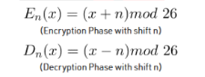
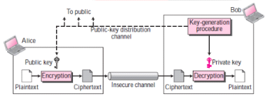
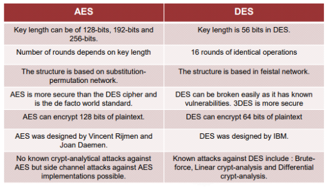

Cryptography

03 January 2025 21:10

- **Study** of **techniques** for **secure communications** through **insecure channels**
- Encryption is the **transformation** of **data** into a **form** in which it **cannot** be **made sense** of **without** the use of some **key.**
- **Modern** cryptography exists at the **intersection** of the **disciplines** of **mathematics, computer science, electrical engineering, communication science**, and **physics.**
- Teaches how to convert sensible data into random junk!

There are five primary functions of cryptography:

- **Privacy/confidentiality:** Ensuring that **no one can read** the message **except** the **intended** receiver.
- **Integrity:** Assuring the receiver that the **received message** has **not been altered** in any way from the original.
- **Authentication:** The process of **proving one's identity.**
- **Non-repudiation:** A mechanism to prove that the **sender really sent** this message.
- **Key exchange:** The method by which **crypto keys** are **shared** between sender and receiver.

Cryptographic Terms

- Plaintext:
  - **Original** message
  - **Anyone** can read
  - E.g, "Alice"
- Cipher
  - Cryptographic **algorithm** or **function**
  - Tells **how to transform** plaintext into that random junk
- Cipher Key
  - **string** of characters
  - Cipherfunction(plaintext + cipher key) = ciphertext
- Cipher text
  - That **random junk** we got after applying cipher key on
  - plaintext
  - Unreadable, **useless**
  - E.g., "#4Tf2%#"
- Encryption
  - **Converting plaintext** into **ciphertext** using **cipher key.**
  - **Cannot** be **reversed without** the use of the **key**
- Decryption
- **Converting ciphertext** into **plaintext** using **cipher key.**
- **Cannot** be **reversed without** the use of the **key**
- Hash
  - **Random fixed length** string
  - **Irreversible one way** function
  - Provides **integrity**
  - E.g., MD5, SHA-1
- Salt
  - **Additional security**
  - Eradicates **brute force** and **cracking**
  - **Random** string **Appended** at **beginning** or **end** of **plaintext**

Types of Cryptography:

Advantages

- Extremely Secure
- Relatively Fast

Disadvantages

- Key management
- Key distribution
- Large number of keys needed (0(n^ 2))

- Advantages
  - **Easier** Key **management**
  - **Easier** key **distribution**
  - **Less number** of **keys** needed (O(n))
- Disadvantages
  - Relatively **slower and complex**
  - **Management** of **public keys**

Encryption Algorithms:

1\.1 Classical Cryptosystem: 

- It manipulates **traditional** characters, i.e., **letters** and **digits directly**.
- **Based** on **symmetric key** encryption scheme.
- It is mainly based on **'security through obscurity'**. The techniques employed for coding were **kept secret** and only the parties involved in communication knew about them.
- It requires the **entire cryptosystem** for communicating confidentially.
- **Consists of two types of Ciphers:**
- **Substitution Cipher**
- **Transposition Cipher**

**Substitution Cipher**

- Any character of plain text from the given fixed set of characters is substituted by some other character from the same set or different depending on a key.
- For example with a shift of 1, A would be replaced by B, B would become C, and so on.

- Example
- Plain Text: I am studying Data Encryption
- Key: 4
- Output: M eq wxyhCmrk Hexe IrgvCtxmsr
- "ABCD" -> "PQRS"

Types:

- Caesar Cipher
- Monoalphabetic Cipher
- Polyalphabetic Cipher
  - Vigenere Cipher
  - Vernam\_Cipher
- Playfair Cipher
- Hill Cipher
- One time Pad

**Caesar Cipher:**

- **Simplest monoalphabetic** form of substitution cipher scheme.
- Generally referred to as the **Shift Cipher**. The concept is to **replace each** alphabet by **another** alphabet which is **'shifted'** by some **fixed number** between 0 and 25.
- This is a **special case** of Shift cipher, with shift equal to 3.

- **Security**: Caesar Cipher is **not a secure** cryptosystem because there are **only 26 possible keys** to try out. An attacker can carry out an exhaustive key search with available **limited** computing resources.

**Monoalphabetic Ciphers:**

- Monoalphabetic cipher is a substitution cipher in which for a given key, the **cipher** alphabet for **each plain** alphabet is **fixed throughout** the encryption process.
- For example, if 'A' is encrypted as for any number of occurrence in that plaintext, 'A' will always get encrypted to 'D'.
- Let **plaintext=** "This is the last warning". With shift of 3, it's **ciphertext=**"Wklv lv wkh odvw zduqlqi".
- **Plaintext** char to **ciphertext** char **relationship** is one to one.
- **Highly susceptible** to **cryptanalysis.**

**Polyalphabetic Ciphers:**

- Polyalphabetic Cipher is a substitution cipher in which the cipher alphabet for the plain alphabet **may be different** at **different places during** the **encryption** process.
- **Playfair and Vigenere Cipher are polyalphabetic ciphers**.
- **For example, plaintext=**"Banana" ,**ciphertext=**"Ozipbe"
- **Plaintext** char to **ciphertext** char **relationship** is one to many.
- **Complex** and **more secure** than monoalphabetic.

**Playfair Cipher:**

- The **Playfair cipher** was the first practical digraph substitution cipher invented in **1854** by **Charles Wheatstone** but was named after Lord Playfair who **promoted** the use of the cipher.
- It was used for **tactical purposes** by **British forces** in the **Second Boer War** and in **World War I** and for the same purpose by the **Australians during World War II.** This was because Playfair is reasonably **fast to use** and requires **no special equipment.**
- Let's take key="monarchy", plaintext="instruments".
- Algorithm: (2 steps)
- Generate the key Square(5x5):

  

- **Algorithm to encrypt the plain text**: The plaintext is **split** into **pairs of two letters** (digraphs). If there is an **odd number** of letters, a **Z is added** to the last letter.
- **PlainText: 'instruments'**
- **After Split: 'in' 1st' 'rut 'mel Int' 'sz'**
- If **two letters** in a pair are **same, add 'x' between** them.
- **PlainText: "steep" split: 'St' 'ex' 'ep'**
- Rules for Encryption

**If both the letters are in the same column:** Take the **letter below each one** (going back 

- **If both the letters are in the same column:** Take the **letter below each one** (going back to the top if at the bottom).
- **If both the letters are in the same row:** Take the letter to **the right of each one** (going back to the leftmost if at the rightmost position).
- **If neither of the above rules is true:** Form a rectangle with the two letters and take the **letters on the horizontal opposite corner** of the **rectangle.**

Ciphertext: gatlmzclrqtx

**Vigenere Cipher:**

- Simple form of **polyalphabetic substitution**, developed by Blaise de Vigenere (1 6th century mathematician)
- Input : Plaintext: GEEKSFORGEEKS
- Keyword : AYUSH
- The given keyword is **repeated in a circular manner** until it **matches the length** of the **plain** text.

Ciphertext : GCYCZFMLYLEIM

- There are two special cases of Vigenere cipher —
- The **keyword length** is **same as plaintext** message. This case is called **Vemam Cipher**. It is **more secure** than typical Vigenere cipher.
- Vigenere cipher becomes a cryptosystem with **perfect secrecy**, which is called **One-time pad.**

**One Time Pad:**

- It is an **unbreakable cipher.**
- The key is **exactly same** as the **length** of **message** which is encrypted.
- The key is made up of **random symbols.**
- As the name suggests, **key** is used **one time only** and **never** used **again** for **any other message** to be encrypted.

  

- **Security**: Let us say, we **encrypt** the name “point” with a one-time pad. It is a **5 letter text.** To break the ciphertext by **brute force**, you need to **try all possibilities** of keys and conduct computation for (26 x 26 x 26 x 26 x 26) = 26^5 = **11881376** times. That’s for a message with 5 alphabets. Thus, for a **longer message**, the computation **grows exponentially** with every additional alphabet. This makes it computationally **impossible to break** the ciphertext by brute additional alphabet. This makes it computationally **impossible to break** the ciphertext by brute force.

Transposition Cipher:

- It is another type of cipher where the order of the alphabets in the **plaintext** is **rearranged** to create the ciphertext The **actual** plaintext alphabets are **not replaced.**
- For example, "banana" is **converted** to "anbana"
- The **plaintext** is "golden Statl-le is in eleventh and the secret random **key** chosen is "five". We **arrange** this text **horizontally** in table with **number of column** equal to **key** value. The resulting text is shown below.

This will be **read column wise** as “gnunea oseenv ltilte daseh etivc”

Transposition Cipher:

- Rail Fence cipher
- Scytale
- Route cipher
- Columnar transposition
- Double transposition
- Myszkowski transposition

**Rail fence Cipher:**

- In the rail fence cipher, the plain-text is **written downwards** and **diagonally** on **successive rails** of an imaginary fence.
- When we **reach** the **bottom** rail, we **traverse upwards** moving **diagonally,** after reaching the **top rail,** the **direction** is **changed** again. Thus the alphabets of the message are written in a **zig- zag manner.**
- After each alphabet has been written, the **individual rows** are **combined** to obtain the cipher- text.

- Message is "GeeksforGeeks" and the number of rails = 3
- Ciphertext: "gsgsekfrekeoe "
- Number of columns in rail fence cipher remains equal to the length of plain-text message.
- Decryption: Then, we **fill** the cipher-text **row wise**. After filling it, we **traverse** the matrix in **zig- zag manner** to obtain the original text.

**Columnar Transposition Cipher:**

- Columnar Transposition involves writing the plaintext out in rows, and then reading the 
- Columnar Transposition involves writing the plaintext out in rows, and then reading the ciphertext off in columns one by one. Algorithm:
- The message is written out in rows of a fixed length, and then read out again column by column, and the columns are chosen in some scrambled order.
- Width of the rows and the permutation of the columns are usually defined by a keyword. is of length 4 (so the rows are of length 4), and the
- For example, the word HACK is of length 4 (so the rows are of length 4), and the permutation is defined by the alphabetical order of the letters in the keyword. In this case, the order would be "3 1 2 4".
- Any spare spaces are filled with nulls or left blank or placed by a character (Example:\_)
- Finally, the message is read off in columns, in the order specified by the keyword.

**Double Transposition Cipher:**

- This was one of the **most secure hand ciphers** used in the Second World War.
- Double Transposition consists of **two applications** of columnar transposition to a message. The two applications **may use** the **same key** for each of the two steps, or they **may use different** keys.
- To **decrypt** a double transposition, **construct** a block with the **right number** of **rows** under the keyword, **blocking off** the **short** columns. Write the **cipher in by columns**, and **read it out by rows.** Lather, rinse, repeat.

1\.2. Modern Cryptosystem:

**Stream Cipher:**

- **Symmetric** Key cipher
- Encrypt the message as a **sequence of bytes**
- Encrypt the data a **bit or byte at a time**

**Block Cipher:**

- **Symmetric Key cipher**
- **Divide** a message into fixed size blocks (64 or 128-bit)
- Encrypt **each block individually**
- **Integrate all** the outputs to obtain final ciphertext

**Asymmetric Key Ciphers:**

- **Symmetric-key** cryptography is **based on sharing secrecy**, **asymmetric-key** cryptography is **based on personal secrecy.**
- In **symmetric-key**, **symbols are permuted** or **substituted,** in **asymmetric-key, numbers are manipulated.**

  

**Shannon's Theory of confusion and diffusion:**

- Introduced to **prevent cryptanalysis,** based on statistical analysis (frequency analysis, etc.) to **deduce** plaintext from ciphertext, or generating key.
- He suggested two methods to achieve this:
  - Confusion
  - Diffusion
- **Confusion** and **diffusion** area unit the properties for creating a secure cipher.
- **Diffusion: Hide the relationship** between **plaintext** and **ciphertext**. If a **single** bit in **plaintext** is changed, **several or all** characters in the **ciphertext** must **change.**
- **Confusion: Hide the relationship** between **key** and **ciphertext**. If a **single** bit in **key** is changed, **several or all** characters in the **ciphertext** must **change.**
- **Confusion** is employed for making **uninformed cipher** text whereas **diffusion** is employed for **increasing the redundancy** of the **plain text** over the foremost a part of the cipher text to **create it obscure**. The **diffusion is solely** employed by **block cipher**, or else, **confusion** is employed by each **stream and block** cipher.
2. Fiestel Cipher:
- It is a **design model** from which many different **block ciphers** are derived. **DES** is just one example of a Feistel Cipher.
- The **encryption** process uses the Feistel structure consisting **multiple rounds** of **processing** of the plaintext, each round consisting of a "**substitution**" step **followed** by a **permutation** step.
- The **input** block to **each round** is **divided** into **two halves** that can be denoted as **L** and **R** for the **left** half and the **right** half.
- In each round, the **right half** of the block, R, goes through **unchanged**. But the **left half**, L, goes through an **operation** that **depends on R** and the **encryption key**, they are **swapped** at the **end** of the round.

- In **real implementation** of the Feistel Cipher, such as DES, instead of using the **whole encryption** key during **each round,** a **round-dependent** key (a **subkey**) is **derived** from the encryption key. This means that each round uses a different key, although all these subkeys are related to the original key.
- The **permutation** step at the end of each round **swaps the modified L** and **unmodified** R. Therefore, the L for the next round would be R of the current round. And R for the next round be the output L of the current round.
- The **number of rounds** are specified by the **algorithm design.**
- Once the last round is **completed** then the two sub blocks, 'R' and 'L' are concatenated in this order to form the ciphertext block.
3. **Data Encryption Standard (DES):** 
- The Data Encryption Standard (DES) is a **symmetric-key block cipher** published by the National Institute of Standards and Technology (NIST).
- DES is an **implementation of a Feistel Cipher.** It uses **16 round Feistel structure.** The **block size is 64-bit**. Though, **key length is 64-bit**, DES has an **effective key length of 56 bits.**
- DES is the **archetypal block** cipher - an algorithm that takes a **fixed-length** string of **plaintext bits** and **transforms** it into a **ciphertext** bitstring of the **same length.**
- Due to the **inherent weakness** of DES with today's technologies, some organizations **repeat the process three times** (3DES) for added strength, until they can afford to update their **equipment to AES** capabilities.
- Since DES is based on the Feistel Cipher, all **that is required** to specify DES is —
- **Round function**
- **Key schedule**
- **Any additional processing — Initial and final permutation**

Round function:

Expansion Permutation function:

Substitution box:

Key Generation:

**DES Analysis:**

- The DES **satisfies both** the **desired** properties of block cipher. These two properties make cipher **very strong.**
  - **Avalanche effect -** A small change in plaintext results in the very great change in the ciphertext.
  - **Completeness** - Each bit of ciphertext depends on many bits of plaintext.
- DES has proved to be a very **well designed** block cipher. There have been **no significant** cryptanalytic **attacks** on DES **other than exhaustive key** search.

  cryptanalytic **attacks** on DES **other than exhaustive key** search.

4. **Attacks on DES:**
- **Weaknesses:**
- **Weak key**
- **Key Size:** 56 bits (Exhaustive Key Search: 2A56)

□ **Four** keys out of 2^56 are **weak: all 0s, all 1s, half 0s, half 1s**

- **Semi weak keys:** Only **two different** round keys
- **Possible weak keys:** Only **four different** round keys
- **Cipher design:**
- **S-box:** Two **specifically** chosen **i/p** can create **same o/p** through S-box

**Brute Force:**

- **Diffie and Hellman proposed** a **machine** costing an estimated **US$20 million** which could find a DES key in a single day
- The **feasibility** of **cracking** DES quickly was **demonstrated** in **1998** when a **custom DES-cracker** was **built** by the **Electronic Frontier Foundation**, at the cost of approximately **USS250,000**
- The machine **brute-forced** a key in a **little more than 2 days'** worth of searching.

**Linear Cryptanalysis:**

- **Discovered** by **Mitsuru Matsui**, and **needs 243 known plaintexts**, based on **finding affine approximations** to the **action** of a **cipher**.
- It was the **first experimental cryptanalysis** of the cipher **reported** in the **open community .**
- **Junod** (2001) performed several **experiments** to determine the **actual time complexity** of linear cryptanalysis, and **reported** that it was **somewhat faster** than predicted, requiring time equivalent to 2^39—2^41 DES **evaluations.**

**Differential Cryptanalysis:**

- **Rediscovered** in the late **1980s** by **Eli Biham** and **Adi Shamir**; it was known earlier to both IBM and the NSA and **kept secret**. To **break** the **full 16** rounds, differential cryptanalysis **requires 2^ 47 chosen plaintexts**. DES was **designed** to be **resistant to DC.**
- Study of **how differences** in information **input can affect** the **resultant difference** at the output, with **chosen plaintext**
- **Discovering where** the cipher exhibits **non-random behavior,** and **exploiting** such properties to **recover** the **secret key** (cryptography key).

**Advancements in DES:**

- Double DES:

  

- Triple DES (3DES):

  

5. **Advanced Encryption Standard (AES):**
- The **more popular** and **widely adopted symmetric encryption** algorithm. It is found at least **six time faster** than **triple DES.**
- The **features** of AES are as follows —
  - Symmetric key **block cipher**
  - **128-bit block** data, **128/192/256-bit keys**
  - **Stronger** and **faster** than Triple-DES
  - Provide **full specification** and **design details**
  - **Software implementable** in C and Java
- It is based on **Rjindael cipher** structure, or '**substitution—permutation network**'.
- AES treats the **128 bits** of a plaintext **block as 16 bytes,** arranged in **four columns** and **four rows** for processing as a **matrix**, called **state** (array).
- The **number of rounds** in AES is variable and depends on the length of the key
  - 1O rounds for 128-bit keys,
  - 12 rounds for 192-bit keys and
  - 14 rounds for 256-bit keys
- **Till date, no practical cryptanalytic attacks** against AES has been **discovered.**

  

**Single Round:**

- **Byte Substitution (SubBytes):** The **16 input bytes** are **substituted** by looking up a fixed **table (S-box)** given in design. The **result** is in a matrix of **four rows** and **four columns.**
- **Shiftrows:** Each of the four rows of the matrix is **shifted** to the **left, circular**
  - **First** row is **not** shifted.
  - **Second** row is shifted **one** (byte) position to the left.
  - **Third** row is shifted **two** positions to the left.
  - **Fourth** row is shifted **three** positions to the left.
- MixColumns: **Each column** of four bytes is now **transformed** using a **special mathematical function**. This function takes as **input** the **four bytes** of **one column** and **outputs four** completely **new bytes**, which **replace** the **original** column. The **result** is another **new matrix** consisting of **16 new bytes**. It should be noted that this step is **not performed** in the **last round.**
- Addroundkey: The **16 bytes** of the matrix are now **considered as 128 bits** and are **XORed** to the **128 bits** of the **round key.** If this is the **last round** then the **output** is the **ciphertext**. **Otherwise**, the resulting 128 bits are interpreted as 16 bytes and we **begin** another **similar round.**
- AES State:

  

- SubBytes:

  

- ShiftRows:

  

- MixColumns:

  

- AddRoundKey:

  

**Strength of AES:**

- In present day cryptography, AES is widely adopted and supported in both hardware and software.
- Till date, no practical cryptanalytic attacks against AES has been discovered.
- Additionally, AES has built-in flexibility of key length, which allows some 'future-proofing' against progress in exhaustive key searches.
- However, just as for DES, the AES security is assured only if it is correctly implemented and good key management is employed.

6. **Block Cipher Modes of Operation:**
- Electronic Code Book (ECB):

  

- Advantages
  - Parallel encryption of blocks of bits is possible
  - Simple
- Disadvantages
- Prone to cryptanalysis since there is a direct relationship between plaintext and ciphertext.
- Two same blocks give same ciphertext
- Cipher Block Chaining (CBC):

  

- Advantages
- CBC works well for input greater than b bits.
- CBC is a good authentication mechanism.
  - CBC is a good authentication mechanism.
  - Better resistive nature towards cryptanalsis than ECB.
- Disadvantages
  - Parallel encryption is not possible since every encryption requires previous cipher.
- Cipher Feedback Mode (CFB):

  

- Advantages
  - Since, there is some data loss due to use of shift register, thus it is difficult for applying cryptanalysis.
  - Randomness of IV not needed
- Disadvantages
- Somewhat slower
- Output Feedback Mode(OFB):

  

- Counter Mode (CTR):

  

- Advantages
  - Simple and fast
  - Does not propagate error of transmission
- Disadvantages
- Requires a synchronous counter at sender and receiver.
- Requires a synchronous counter at sender and receiver.
6. Stream Ciphers:
- **RC4:** a **variable key-size stream cipher** with **byte-oriented** operations. The algorithm is based on the **use of a random permutation.**
- **RC5:** a **parameterized** algorithm with a **variable block size,** a variable **key size,** and a variable **number of rounds**. Allowable choices for the **block** size are **32 bits, 64 bits and 128 bits**. The **number of rounds** can range from **0 to 255**, while the **key** can  range from **0 bits to 2040 bits** in size. RC5 has **three routines**: **key expansion**, **encryption**, and **decryption**.
- **RC6:** a **block cipher based on RC5**. RC6 is a **parameterized** algorithm where the block size, the key size, and the number of rounds are variable. The **upper limit** on the **key size is 2040 bits**. RC6 **adds two features** to RC5: the inclusion of **integer multiplication** and the use of **four 4-bit working registers** instead of **RC5'S two 2-bit registers**.

**Public Key Cryptography:**

**Rivest Shamir Adleman (RSA) Algorithm:**

- Based on the fact that finding the factors of a large composite number is difficult: when the factors are prime numbers
- RSA involves a public key and private key. The public key can be known to everyone; it is used to encrypt messages. Messages encrypted using the public key can only be decrypted with the private key.
- Many protocols like Secure Shell, OpenPGP, S/MIME, and SSL/TLS rely on RSA for encryption and digital signature functions.

7. Message Digest (One-way Hash) Functions:
- A hash function is a **mathematical function** that **converts** a **numerical input** value into another **compressed numerical value**. The **input** to the hash function is of **arbitrary** length but **output** is **always** of **fixed length**.
- Values returned by a hash function are called **message digest** or simply **hash values**.
- Generally for any **hash function h** with **input x**, computation of **h(x)** is a **fast operation**.
- **Computationally** hash functions are **much faster than** a **symmetric** encryption.

**Features:**

- Hash function converts data of **arbitrary length** to a **fixed length**. This process is often referred to as **hashing the data**.
- In general, the **hash** is **much smaller** than the **input** data, hence hash functions are sometimes called **compression functions.**
- Since a hash is a **smaller representation** of a **larger data**, it is also referred to as a **digest**.
- Hash function with **n bit output** is referred to as an **n-bit hash function**. Popular **hash** functions generate **values** between **160 and 512 bits**.

Properties

- **Pre-lmage Resistance:** This property means that it should be **computationally hard** to **reverse** a hash function.
- **Second Pre-lmage Resistance:** This property means given an input and its hash, it should be **hard** to find **a different input** with the **same hash.**
- **Collision Resistance:** This property means it should be hard to find **two different inputs** of any length that result in the **same hash**. This property is also referred to as **collision free** hash function.

Popular Hash Functions

- **Message Digest (MD)**: **MD2**, **MD4, MD5** and **MD6**. It was adopted as **Internet Standard RFC 1321**. It is a **128-bit** hash function. In **2004**, **collisions** were **found** in **MD5**, and an **analytical attack** was reported to be **successful** only in an **hour** by using **computer cluster**.
- **Secure Hash Function (SHA): SHA-0, SHA-1 , SHA-2**, and **SHA-3. SHA-2** family has **four further** SHA variants, **SHA-224, SHA-256, SHA-384**, and **SHA-512**. **No** successful **attacks** have **yet** been reported on **SHA-2** hash function.
- **RIPEMD: RACE Integrity Primitives Evaluation Message Digest**. The set includes **RIPEND, RIPEMD-128**, and **RIPEMD-160**. There also exist **256**, and **320-bit versions** of this algorithm.

Applications of Hash Functions:

- Password Storage:

  

- Data Integrity Check (Digital Signatures):

  

8. **Secure Hash Algorithm (SHA-256):**
- **SHA-2 Secure Hash Algorithm 2)** is a set of cryptographic hash functions **designed** by the **United States National Security Agency (NSA)**
- The SHA-2 **family** consists of **six hash functions** with **digests** (hash values) that are 224, 256, 384 or 512 bits: **SHA-224, SHA-256, SHA-384, SHA-512, SHA-512/224, SHA-512/256**
- SHA-2 was **published in 2001** by the **National Institute of Standards** and **Technology** 
- Currently, the **best public attacks** break **preimage resistance** for **52 out of 64 rounds** of **SHA-256** or **57 out of 80** rounds of **SHA-512**, and **collision resistance** for **46 out of 64** rounds of **SHA-256**

Algorithm

- **Pre-processing:**
1. **Padding**. If we note **M** the **message** to be hashed, and l its **length** in bits where **l < 2⁶⁴**, then as a first step we create the **padded** message M’, which is message **M plus a right padding**, such that M’ is of length l’, a **multiple of 512**

   

2. **Blocks**. M’ is **parsed** into N blocks of size **512 bits**, **M¹** to **Mᴺ**, and **each block** is **expressed** as **16** input blocks of **size 32 bits**, **M₀** to **M₁₅**.

   

3. **Hash initialization**. The **initial hash value H⁰** of length **256 bits** (8 input blocks of 32 bits) is set by taking the **first 32 bits** of the **fractional** parts of the **square roots** of the **first eight prime** numbers:

9. **Transport Layer Security:**
- **SSL (Secure Sockets Layer)** 
- **SSL (Secure Sockets Layer)** 
- SSL is an **application layer protocol** developed by **Netscape** for managing the **security** of a **message transmission** on the Internet.
- It uses **RSA asymmetric** (public key) encryption to encrypt data transferred over SSL connections.
- Transport Layer Security (TLS) 
- TLS is a protocol to establish a **secure connection** between a client and a server and ensure **privacy** and **integrity** and **authentication** of information during transmission. 
- It uses the **RSA algorithm** with **1024** and **2048** bit strengths. 
- **TLS Handshake Protocol:** It allows the client and server to **authenticate** each other, **select encryption algorithm**, and **exchange symmetric key** prior to data exchange. 
- **TLS Record Protocol:** It provides **secured connections** with an encryption method such as Data Encryption Standard (**DES**). 

10. **Pretty Good Privacy (PGP):**
- PGP (Pretty Good Privacy) created by Phil Zimmerman, is a protocol used to encrypt and decrypt data that provides authentication and cryptographic privacy. 
- PGP is often used for data compression, digital signing, encryption and decryption of messages, emails, files, directories, and to enhance privacy of email communications. 
- PGP combines the best features of both conventional and public key cryptography and is therefore known as hybrid cryptosystem. 
- PGP and similar software follow the OpenPGP, an open standard of PGP encryption software, standard (RFC 4880) for encrypting and decrypting data. 

**Public Key Infrastructure (PKI):**

- The most distinct feature of Public Key Infrastructure (PKI) is that it uses a **pair of keys** to **achieve** the **underlying security service**. 
- Since the **public** keys are in **open domain**, they are **likely** to be **abused**. It is, thus, **necessary** to establish and **maintain** some kind of **trusted infrastructure** to **manage** these **keys**. 
- **Key Management:** 
- Cryptographic keys are nothing but **special pieces of data**. Key management refers to the **secure administration** of cryptographic keys. 
- Key management deals with **entire key lifecycle**.

  

There are **two specific requirements** of **key management** for public key cryptography. 

- **Secrecy of private keys**. Throughout the key lifecycle, **secret** keys **must remain secret** from all parties **except** those who are **owner** and are **authorized** to use them. 
- **Assurance of public keys**. In public key cryptography, the public keys are in **open domain** and **seen as public** pieces of data. **By default** there are **no assurances** of whether a public key is **correct**, with whom it can be **associated,** or **what** it can be **used for**. 

**Public Key Infrastructure (PKI):**

- PKI provides **assurance of public key**. It provides the **identification** of **public keys** and their **distribution**. An anatomy of PKI comprises of the following components. 
- **Public Key Certificate**, commonly referred to as **‘digital certificate’.** 
- **Private Key tokens**. 
- **Certification Authority**. 
- **Registration Authority**. 
- **Certificate Management System**.
1. **Digital Signatures:**
- **Digital certificates** are based on the **ITU standard X.509** which defines a standard **certificate format** for public key certificates and certification **validation.** 
- Public key **pertaining to the user** client is **stored** in digital **certificates** by The **Certification Authority (CA)** along with other relevant information such as **client information, expiration date, usage, issuer** etc. 
- CA **digitally signs** this entire information and **includes digital signature** in the certificate. 
- Anyone who needs the assurance about the public key and associated information of client, he **carries** out the **signature validation** process using **CA’s public key**. Successful validation **assures** that the **public key given** in the **certificate belongs** to the **person** whose details are **given in the certificate**.

  

  

2. Certification Authorities:
- CA **issues certificate** to a client and **assist** other users to **verify the certificate.** The CA takes **responsibility** for **identifying correctly** the **identity** of the **client** asking for a certificate to be issued, and ensures that the **information contained** within the certificate is **correct** and **digitally signs it**.
- **Key Functions of CA:**
  - **Generating key pairs** 
  - **Issuing digital certificates** 
  - **Publishing Certificates** 
  - **Verifying Certificates** 
  - **Revocation of Certificates**
- **Classes of Certificates:** There are **four typical** classes of certificate −
- **Class 1** − These certificates can be **easily acquired** by **supplying** an **email** address. 
- **Class 2** − These certificates require **additional personal information** to be supplied. 
- **Class 3** − These certificates can only be **purchased after checks** have been made about the **requestor’s identity**. 
- **Class 4** − They may be **used** by **governments** and **financial organizations** needing **very high levels** of **trust**.
- **Registration Authority (RA):** 
- CA may use a **third-party** Registration Authority **(RA)** to perform the **necessary checks** on the person or company requesting the certificate to confirm their identity. The RA may **appear** to the **client as a CA**, but they **do not actually sign** the certificate that is issued. 
- **Certificate Management System (CMS):** 
- It is the **management system** through which certificates are **published, temporarily** or **permanently suspended, renewed,** or **revoked.**
- **Hierarchy of CA:**

It is practically **not feasible** to have **only one trusted CA** from whom **all users** obtain 

- It is practically **not feasible** to have **only one trusted CA** from whom **all users** obtain their certificates, also **may lead** to **difficulties** if CA is **compromised.** 
- The **root CA** is at the **top** of the CA **hierarchy** and the root CA's certificate is a **self-signed certificate**. 
- The CAs, which are **directly subordinate** to the root CA (For example, CA1 and CA2) have **CA certificates** that are **signed by the root** CA. 
- The CAs **under the subordinate** CAs in the hierarchy (For example, CA5 and CA6) have their CA certificates **signed** by the **higher-level subordinate** CAs.

•

- A **client** whose authenticity is being verified **supplies his certificate**, generally along with the **chain of certificates up to Root CA**. 
- **Verifier** takes the certificate and **validates** by using **public key of issuer**. The issuer’s public key is **found** in the **issuer’s certificate** which is in the **chain next** to **client’s certificate**. 
- Now if the **higher CA** who has signed the issuer’s certificate, is **trusted** by the **verifier**, 
- Now if the **higher CA** who has signed the issuer’s certificate, is **trusted** by the **verifier**, verification is **successful** and **stops** here. 
- Else, the **issuer's certificate** is **verified** in a similar manner **as done** for **client** in above steps. This process **continues** till either **trusted CA is found** in between or else it **continues till Root CA.**

**Cryptanalysis:**

- Study of **analyzing information** systems in order to **study the hidden** aspects of the systems. Cryptanalysis is used to **breach cryptographic security** systems and **gain access** to the **contents** of **encrypted** messages, even if the cryptographic **key is unknown**. 
- **Methods** and **techniques** to **reverse** the **principles** of **cryptography without knowing** the applied **algorithms** and encryption **key**. 
- Cryptanalysis includes the study of **side-channel** attacks that **do not target weaknesses** in the cryptographic **algorithms** themselves, but instead **exploit weaknesses** in their **implementation**. 
- **Amount of information available to the attacker** 
  - **Ciphertext-only**: the cryptanalyst has access only to a **collection of ciphertexts** or codetexts. 
  - **Known-plaintext**: the attacker has a **set of ciphertexts to which** he **knows** the corresponding **plaintext.** 
  - **Chosen-plaintext (chosen-ciphertext)**: the attacker can **obtain the ciphertexts** (plaintexts) **corresponding** to an **arbitrary set of plaintexts** (ciphertexts) of his **own choosing**.
- **Amount of information available to the attacker** 
- **Adaptive chosen-plaintext**: like a **chosen-plaintext** attack, except the attacker **can choose subsequent plaintexts** based on information **learned** from **previous** encryptions. Similarly **Adaptive chosen ciphertext attack**. 
- **Related-key attack**: Like a **chosen-plaintext** attack, except the attacker can **obtain ciphertexts encrypted under two different keys.** The **keys** are **unknown**, but the **relationship** between them is **known**; for example, two keys that differ in the one bit.

**Symmetric ciphers:** 

- Boomerang attack 
- Brute-force attack 
- Davies' attack 
- Differential cryptanalysis 
- Impossible differential cryptanalysis Improbable differential cryptanalysis 
- Improbable differential cryptanalysis 
- Integral cryptanalysis
- Linear cryptanalysis
- Meet-in-the-middle attack
- Related-key attack
- Sandwich attack
- Slide attack
- XSL attack
- **Attacking cryptographic hash systems:**
- Birthday attack
- Hash function security summary
- Rainbow table
- **Side-channel attack:**
- Attack based on **information gained** from the **implementation** of a computer system, **rather than weaknesses** in the implemented **algorithm** itself. **Timing** information, **power consumption**, **electromagnetic leaks** or **even sound** can provide an **extra source** of information, which can be **exploited.** 
- Some side-channel attacks require **technical knowledge** of the **internal operation** of the system, although others such as **differential power analysis** are effective as **black-box** attacks.

**General:** 

- **Cache attack** — attacks based on attacker's ability to **monitor cache accesses made** by the **victim** in a shared physical system as in **virtualized** environment or a type of **cloud** service. (**Meltdown** and **Spectre** in 2017) 
- **Timing attack** — attacks based on measuring **how much time** various **computations** (such as, say, comparing an attacker's given password with the victim's unknown one) **take** to perform. 
- **Power-monitoring attack** — attacks that make use of **varying power consumption** by the hardware **during computation**.
- **Electromagnetic attack** — attacks based on **leaked electromagnetic radiation**, which can **directly provide plaintexts** and other information. Such measurements can be used to **infer cryptographic keys** using techniques equivalent to those in **power analysis** or can be used in **non-cryptographic** attacks, e.g. **TEMPEST** (aka **van Eck phreaking** or **radiation monitoring**) attacks. 
- **Acoustic cryptanalysis** — attacks that **exploit sound produced** during a computation (rather like power analysis). 
- **Differential fault analysis** — in which **secrets** are **discovered** by **introducing faults in a computation**.

  **computation**.

- **Data remanence** — in which **sensitive data** are **read after supposedly** having been **deleted.** (i.e. Cold boot attack) 
- **Software-initiated fault attacks** — Currently a **rare class** of side-channels, **Row hammer** is an example in which **off-limits memory** can be **changed** by **accessing adjacent memory** too **often** (causing **state retention loss**). 
- **Optical** - in which **secrets and sensitive data** can be **read by visual recording** using a high resolution **camera**, or other devices that have such capabilities.

Modern hashing algorithm:

1. **Bcrypt:**
- MD and SHA families are **designed** to be **computationally fast** 
- bcrypt is **designed** to be computationally **slow** 
- Bcrypt can **evolve** alongside **hardware** technology 
- Function **scales** with **computing power** 
- **Design specification**: must **account** for rapidly **evolving hardware** and constant password **length.** 

**Q. What is bcrypt ?**

- B for blowfish and crypt for **name** of **hashing** function used by the **UNIX** 
- **Crypt** is great example of **failure to adopt** to technology 
- Blowfish cipher:
  - **Fast block** cipher **except** when **changing keys** 
  - Each **new** key requires the **pre-processing** equivalent to encryption about 4 kilobytes of text 
  - Bcrypt **uses** the **expensive setup phase** of the blowfish cipher to develop a **new key setup** algorithm for blowfish named "eksblowfish'
- Algorithm: 
  - **Phase 1**: key scheduling (eksblowfishsetup)
  - **Derive** a set of **subkeys** from a **primary** key (password)
  - **Key stretching** 
- **Phase 2**: Encryption (orpheanbeholderscrydoubt)
  - Encryption **64 times** using ekblowfish in **ECB** mode 
  - Output is the **cost** and the **128-bit salt** value **concatenated** with the result of the **encryption loop.**
- **Features of bcrypt:**
- **Preimage resistance** 
- **Adaptive** 
- Over time, the **iteration count** can be **increased** to make it **slower** 
- Requires a **salt by default** 
2. **Argon2:**
- **Winner of PHC, july 2015**
- **Versions:**
  - **Argon2i: safest** option against **side-channel** attacks and **storing** passwords, **vulnerable** to **time-memory** tradeoffs
  - **Argon2d**: **safest** option **GPU cracking** attacks and **key derivation, vulnerable** to **side channel** 
  - **Argon2id**: works as **Argon2i** for the **first half** of the **first iteration** over the **memory** and as **Argon2d** for the **rest**, thus providing **both** side-channel **attack protection** and bruteforce cost savings due to time-memory tradeoffs.
- **Tuning parameters:**
- A time cost, which defines the **execution** time.
- A memory cost, which defines the **memory usage**.
- A parallelism degree, which defines the number of **threads**.
- In 2022, **MD and SHA** families are **not suitable** for **storing** passwords 
- In 2022, **MD and SHA** families are **not suitable** for **storing** passwords 
- Most **recent** and **reasonable** choices: Scrpty, Bcrypt and Argon2
- We need a **slow function** that's been **vetted** by the **crypt community** and remains **unbroken** 
- **Bcrypt:**
- **Not known to be broken but yet very old (1999)**
- **Better** job at being **GPU/ASIC resistant** than PBKDF2
- A paper in 2014 describes a **hybrid** a system of **ARM/FPGA SOCs** to **attack** the algorithm.
3. Scrypt:
- **Newer** than Bcrypt, **better design** than Bcrypt in regards to **memory hardness** 
- Used for many **cryptoccurrencies** and we have a few **hardware** (both FPGA and ASIC) **implementation** of it.
- **Conclusion: depend on your thread model** 
- **Generic thread model:**
- Perfer Argon2 over Scrypt 
- Perfer Scrypt over Bcrypt 
Fundamentals Page 36
